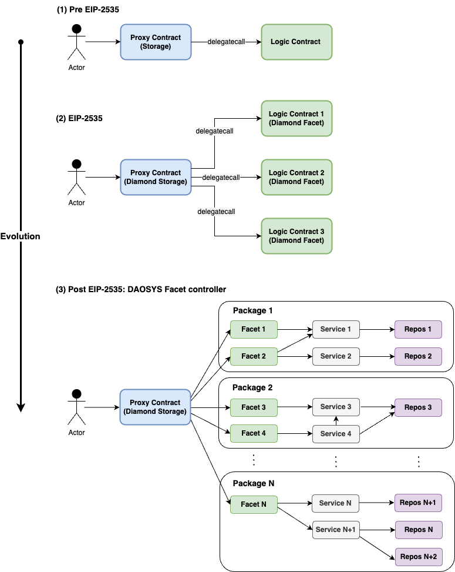

# Evolution of Proxy Contracts

<figure><figcaption>
FIGURE 1: Hyper-diamond standard consisting of delegate Services that replace facets defined in ERC-2535
</figcaption></figure>


**Facet:** where delegation operations are implemented

**Service:** where business logic is implemented (eg, DAOSYS DeFi Strategy)

**Repos:** where CRUD operations are implemented


### Evolution of Multi-facet Diamonds

<figure><figcaption>
FIGURE 3: Evolution of Hyper-diamond standard
</figcaption></figure>


**Good to know:** DAOSYS is analogous to MVC design framework

